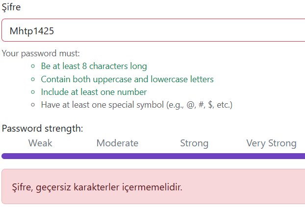

Bug ID: BUG_001
Title: Incorrect validation message is displayed when the password does not contain a special symbol

Environment:
Windows 11
Google Chrome
Practice Software Testing

Precondition: Registration page must be available.

Steps to Reproduce:
    1. Open the registration page.
    2. Enter valid user information.
    3. Enter a valid email address.
    4. Enter "Mhtp1234" in the password field.
    5. Click the Register button.

Actual Result: The registration attempt is rejected and the message
"Password must not contain invalid characters"
is displayed.

Expected Result: The registration attempt should be rejected and a validation message should clearly indicate that the password must contain at least one special symbol.

Evidence:

Severity:
Low

Priority:
Medium

Status:
Open